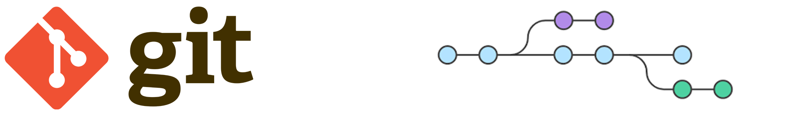

# Versions Script.

Repositorio para desarrollar script y documentar sus diferentes versiones hasta llegar a la version final.

## Lista de librerias

* [Descripcion de librerias](##Descripcion-de-librerias)
  - [Logger](###Logger)

## Lista de scripts

## Descripcion de librerias

### Logger

Logger: libreria para hacer registro de procesos en aplicaciones hechas en node, tiene como base la libreria `winston.js` y ademas de dependecias `moment-timezone`, `winston-daily-rotate-file` y modulos propios de `node.js` como son: `path` `fs` `os`

## Descripcion de scripts

## Notas.

### Versionado de software

El versionado de software es el proceso de asignación de un nombre, código o número único, a un software para indicar su nivel de desarrollo.

#### Versionado tradicional

Generalmente se asigna dos números, mayor.menor (en inglés: major.minor), que van incrementando conforme el desarrollo del software aumente y se requiera la asignación de un nuevo nombre, código o número único. Aunque menos habituales, también puede indicarse otro número más, micro, y la fase de desarrollo en que se encuentra el software.

Se aumenta el número cuando:

- **mayor:** el software sufre grandes cambios y mejoras.
- **menor:** el software sufre pequeños cambios y/o correcciones de errores.
- **micro:** se aplica una corrección al software, y a su vez sufre pocos cambios.
- **fase:** se indica si se encuentra en una fase de desarrollo que no sea la final o estable, es decir, una fase inestable o en pruebas. Se suele indicar con un guion seguido de la fase correspondiente en minúsculas, o un espacio seguido de la fase. Puede haber varias versiones de una misma fase, para indicar el avance en el desarrollo del software pero manteniendo la fase para indicar que todavía es inestable, indicándose añadiendo un número al final del nombre de la fase que va incrementando conforme se publiquen nuevas versiones de esta fase.

